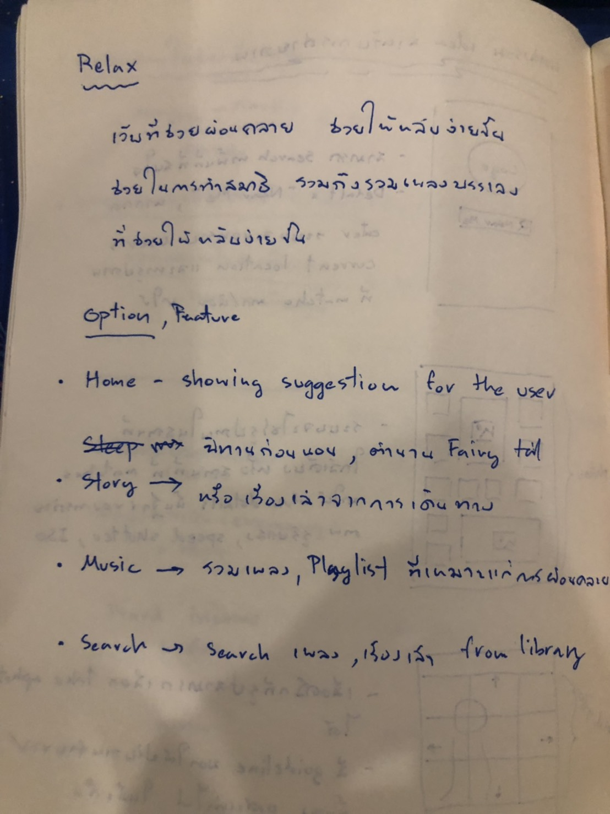
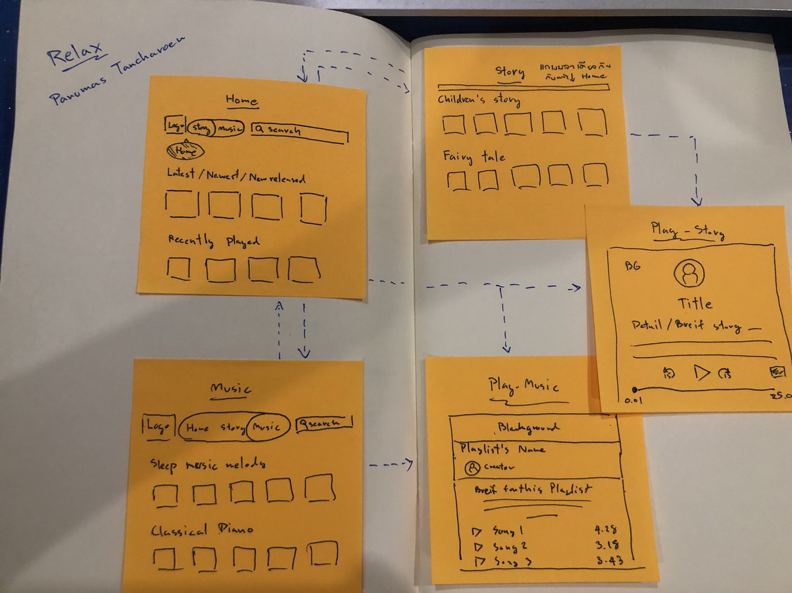

## Codecamp Fullstrack Javascript#7

### Name: Panumas Tancharoen  
### Email: pack.panumas@gmail.com   

---

# UX/UI Design

## 1.หาเว็บไซต์ 1 อัน ให้ครอบคลุม มีไม่ครบ 6 ข้อ  

- Useful: มีประโยชน์
- Usable: ใช้งานง่าย
- Findable: หาสิ่งที่ต้องการได้ง่าย
- Credible: น่าเชื่อถือ
- Desirable: น่าใช้
- Accessible: เข้าถึงได้ง่าย
 

> Answer

> เว็บไซต์: http://www.cookingforengineers.com/

>- Useful: มีประโยชน์สำหรับคนที่ชื่นชอบการทำอาหาร และทดลองสูตรใหม่ๆ
>- Usable: พอใช้ได้
>- Findable: หาสิ่งที่ต้องการได้ค่อนข้างง่าย
>- Credible: ไม่ค่อยน่าเชื่อถือ
>- Desirable: ไม่น่าใช้ website has no user friendly
>- Accessible: เข้าถึงได้ง่าย

---
---

## 2.เล่าเรื่องอะไรก็ได้เกี่ยวกับตัวเอง 3 ข้อ โดย 2 ข้อเป็นเรื่องจริง อีก 1 ข้อ เป็นเรื่องโกหก
> Answer
>- เป็นคนรักวิทยาศาสตร์และสิ่งแวดล้อม
>- ชอบอยู่ท่ามกลางผู้คน
>- เป็นเจ้าของรถมากกว่า 40 คัน

---
---

## 3.คิดทำ Startup อะไรสักอย่าง
> Answer
> 
---
---

## 4.เขียน Low-Fidelity Wireframe ลง Post-it หนึ่งแผ่นต่อหนึ่งหน้า
- เขียนชื่อหน้าจอกำกับด้วย

> Answer
> 
---
---

## 5.ทำทุกอย่างใหม่ให้เป็น Figma
- โจทย์ที่ 1 - Login Page
- โจทย์ที่ 2 - เปลี่ยนหน้า
- โจทย์ที่ 3- ใช้ UI Kit

> Answer  
> *__Please click Link below - Page "Prototype"__*
https://www.figma.com/file/c5CVmvoRuDuX8V8zGqi1wv/Pack-s-Relax-Prototype?node-id=0%3A1

---
---

## 6.หา Mobile App ที่จะเป็น Inspiration ด้าน design ให้เราได้ อย่างน้อย 3 App

> Answer  
> *__Please click Link below - Page "Inspiration"__*
https://www.figma.com/file/c5CVmvoRuDuX8V8zGqi1wv/Pack-s-Relax-Prototype?node-id=12%3A0

---
---

## 7.ทำ Moodboard ใส่ Figma ใส่เป็นอีก File

> Answer  
> *__Please click Link below - Page "Moodboard"__*
https://www.figma.com/file/c5CVmvoRuDuX8V8zGqi1wv/Pack-s-Relax-Prototype?node-id=13%3A191